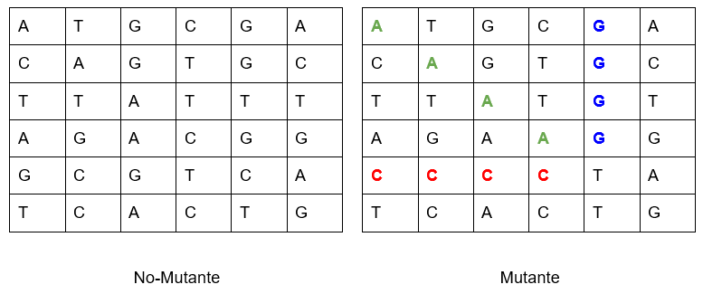

# PARCIAL DESARROLLO DE SOFTWARE
Parcial de la materia "Desarrollo de Software"

## Alumno
- Corazza María Cecilia
- Legajo 50230
- Comisión 3k10
- Año 2024

## Tabla de Contenidos
- **[Consigna](#consigna)**
- **[Ejecución](#ejecucion)**

 

# Consigna
**Examen Mercadolibre**

Magneto quiere reclutar la mayor cantidad de mutantes para poder luchar contra los X-Mens.

Te ha contratado a ti para que desarrolles un proyecto que detecte si un humano es mutante basándose en su secuencia de ADN.

Para eso te ha pedido crear un programa con un método o función con la siguiente firma:

`boolean isMutant(String[] dna);`

En donde recibirás como parámetro un array de Strings que representan cada fila de una tabla de (NxN) con la secuencia del ADN. Las letras de los Strings solo pueden ser: (A,T,C,G), las cuales representa cada base nitrogenada del ADN.

Sabrás si un humano es mutante, si encuentras más de una secuencia de cuatro letras iguales, de forma oblicua, horizontal o vertical.

Ejemplo (Caso mutante):

String[] dna = {"ATGCGA","CAGTGC","TTATGT","AGAAGG","CCCCTA","TCACTG"};

En este caso el llamado a la función isMutant(dna) devuelve “true”. 

Desarrolla el algoritmo de la manera más eficiente posible programado en el lenguaje Java con spring boot. Crea las clases necesarias y la verificación en el método main. 

## Desafíos:

### Nivel 1:
Programa  en java spring boot que cumpla con el método pedido por Magneto utilizando una arquitectura en capas de controladores, servicios y repositorios.

### Nivel 2:
Crear una API REST, hostear esa API en un cloud computing libre (Render), crear el servicio “/mutant/” en donde se pueda detectar si un humano es mutante enviando la secuencia de ADN mediante un HTTP POST con un Json el cual tenga el siguiente formato:

POST → /mutant/
{ “dna”:["ATGCGA","CAGTGC","TTATGT","AGAAGG","CCCCTA","TCACTG"]
}

En caso de verificar un mutante, debería devolver un HTTP 200-OK, en caso contrario un 403-Forbidden

### Nivel 3:
Anexar una base de datos en H2, la cual guarde los ADN’s verificados con la API. Solo 1 registro por ADN.
Exponer un servicio extra “/stats” que devuelva un Json con las estadísticas de las verificaciones de ADN: 

{“count_mutant_dna”:40, “count_human_dna”:100: “ratio”:0.4}

Tener en cuenta que la API puede recibir fluctuaciones agresivas de tráfico (Entre 100 y 1 millón de peticiones por segundo). Utilizar Jmeter 

 

# EJECUCIÓN
Pará emoción, recién lo subo
no sé que lleva un readme salu2
### Base de datos:
La base de datos se encuentra almacenada localmente en /h2-parcial

