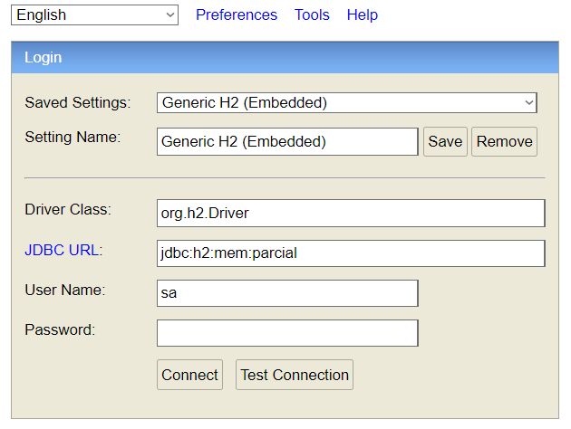

# PARCIAL DESARROLLO DE SOFTWARE
Parcial backend de la materia "Desarrollo de Software"

3er año ingeniería en sistemas, UTN


## Alumno
- Corazza María Cecilia
- Legajo 50230
- Comisión 3k10
- Año 2024


# Contenidos
(hacer click para navegar)

- **[Caracteristicas](#caracteristicas)**
- **[Estructura del proyecto](#estructura)** 
- **[Ejecucion](#ejecucion)**
- **[Deploy en Render](#deploy)**
- **[Base de Datos](#bd)**
- **[Endpoints](#endpoints)**
- **[Ejemplos de ADN](#adn)**


<div id="caracteristicas"></div>

# Características
**Nivel 1**
- **Detección de Mutantes**: Verifica si una secuencia de ADN es mutante. Un ADN es mutante si posee 4 símbolos seguidos iguales de manera horizontal, vertical, diagonal y diagonal inversa/

**Nivel 2**
- **API REST**: Expone endpoints para verificar secuencias de ADN y obtener estadísticas.

**Nivel 3**
- **Base de Datos H2**: Almacena los resultados de las verificaciones de ADN.
- **Tests Unitarios**: Incluye tests unitarios para asegurar la correcta funcionalidad del servicio.
- **Validación de Entrada**: Asegura que las secuencias de ADN sean válidas antes de procesarlas.

**Otros**
- **Diagrama de secuencia:** Se encuentra en el siguiente [link](https://github.com/checorazza/parcial-mercadolibre-mutantes/blob/master/PDFS/SECUENCIA%20ISMUTANT.pdf) o en la carpeta PDFS del repositorio.

#### IsMutant()


#### GetStats()


- **Pruebas de stress:** Se realizaron tests en JMeter con éxito

Repositorio > PDFS > Diagrama Secuencia

<div id="estructura"></div>

# Estructura del Proyecto

**Controladores**
- **ADNController:** Controlador para manejar las solicitudes HTTP relacionadas con el ADN.
- **StatsController:** Controlador para manejar las solicitudes HTTP relacionadas con las estadísticas.

**Repositorios**
- **ADNRepository:** Repositorio para interactuar con la base de datos H2.

**Servicios**
- **ADNService:** Servicio para la lógica de negocio relacionada con el ADN.
- **StatsService:** Servicio para la lógica de negocio relacionada con las estadísticas.

**DTOs**
- **ADNRequest:** Encapsula el arreglo de Strings de la secuencia de ADN

**Utils**
- **ADNValidator:** Validador para asegurar que las secuencias de ADN sean válidas.

**Tests**

El proyecto incluye tests unitarios para ADNService utilizando JUnit y Mockito. Los tests verifican diferentes casos de prueba, incluyendo secuencias de ADN mutantes y no mutantes, así como validaciones de entrada.

Los test, de acuerdo a Java Coverage instalado por defecto en el IDE IntelliJ, cubren el 100% del código:


También incluye tests de stress realizados con éxito con 1000 peticiones de usuarios, el cual el archivo .jmx y las capturas con los resultados está disponible en la carpeta "PDFs"


<div id="ejecucion">

# Ejecución

## Deploy en Render
La API se encuentra en Render. Puede acceder a ella a través del siguiente enlace:

https://parcial-mercadolibre-mutantes.onrender.com


## Base de datos:
La base de datos se encuentra almacenada localmente en

`http://localhost:8080/h2-parcial`

La consola de H2 debería verse más o menos así:




## Endpoints
Las peticiones se pueden realizar a:

**POST -> /mutant**

- Localmente: `http://localhost:8080/mutant`
- En Render: https://parcial-mercadolibre-mutantes.onrender.com/mutant 

    Recibe un array de Strings de una secuencia de ADN en JSON, devuelve si la secuencia es de un ADN mutante o humano.

**GET -> /stats**
- Localmente: `http://localhost:8080/stats`
- En render: https://parcial-mercadolibre-mutantes.onrender.com/stats

    Devuelve la cantidad de ADN mutante y ADN humano en la base de datos, y el ratio entre ambos (cantidad de mutantes por cada humano).

## Uso

### Verificar Secuencia de ADN
Envía una solicitud POST a /mutant/ con un JSON que contenga la secuencia de ADN:

```
{
  "secuencia": [
    "ATGCGA",
    "CAGTGC",
    "TTATGT",
    "AGAAGG",
    "CCCCTA",
    "TCACTG"]
}
```

- Respuesta 200 OK: Si la secuencia de ADN es mutante.
- Respuesta 403 Forbidden: Si la secuencia de ADN no es mutante.

### Obtener Estadísticas
Envía una solicitud GET a /stats/ para obtener las estadísticas de las verificaciones de ADN:

```
{
  "contadorADNMutante": 40,
  "contadorADNHumano": 100,
  "ratio": 0.4
}
```

<div id="adn"> </div>

# Ejemplos de ADN
Se incluye una lista de ejemplos de ADN mutante/no mutante.
También el proyecto cuenta con pruebas unitarias con cada caso.

- Ejemplo ADN humano (no mutante):
```
{
    "secuencia": [
        "ATGCGA",
        "CAGTGC",
        "TTATTT",
        "AGACGG",
        "CCTCTA",
        "TCACTG"
    ]
}
```
- Ejemplo ADN mutante (horizontal):
```
{
    "secuencia": [
        "AAAAAA",
        "CAGTGC",
        "TTATGT",
        "AGAAGG",
        "CCCCTA",
        "TCACTG"
    ]
}
```
- Ejemplo ADN mutante (vertical):
 ```
 {
    "secuencia": [
        "ATGCGA",
        "AAGTGC",
        "ATATGT",
        "AGAAGG",
        "ACCCCT",
        "ATCACT"
    ]
 }
```
- Ejemplo ADN mutante (diagonal):
```
{
    "secuencia": [
        "ATGCGA",
        "CAGTGC",
        "TTATGT",
        "AGAAGG",
        "CCCCTA",
        "TCACTG"
    ]
}
``` 
ㅤ<br>
ㅤ<br>
ㅤ<br>
ㅤ<br>
ㅤ<br>
ㅤ<br>
ㅤ<br>
ㅤ<br>
ㅤ<br>
ㅤ<br>
ㅤ<br>
ㅤ<br>
ㅤ<br>
ㅤ<br>
ㅤ<br>
ㅤ<br>
ㅤ<br>
ㅤ<br>
ㅤ<br>
ㅤ<br>
ㅤ<br>
ㅤ<br>
ㅤ<br>
ㅤ<br>
ㅤ<br>
ㅤ<br>
ㅤ<br>
ㅤ<br>
ㅤ<br>
ㅤ<br>
ㅤ<br>
ㅤ<br>
ㅤ<br>
ㅤ<br>
ㅤ<br>
ㅤ<br>
ㅤ<br>
ㅤ<br>
ㅤ<br>
ㅤ<br>
ㅤ<br>
ㅤ<br>
ㅤ<br>
ㅤ<br>
ㅤ<br>
ㅤ<br>
ㅤ<br>
ㅤ<br>
ㅤ<br>
ㅤ<br>
ㅤ<br>
ㅤ<br>
ㅤ<br>
ㅤ<br>
ㅤ<br>
ㅤ<br>
ㅤ<br>
ㅤ<br>
ㅤ<br>
ㅤ<br>
ㅤ<br>
ㅤ<br>
ㅤ<br>
ㅤ<br>
ㅤ<br>
ㅤ<br>
ㅤ<br>
ㅤ<br>
ㅤ<br>
ㅤ<br>
ㅤ<br>
ㅤ<br>
ㅤ<br>
ㅤ<br>
ㅤ<br>
ㅤ<br>
ㅤ<br>
ㅤ<br>
ㅤ<br>
ㅤ<br>
ㅤ<br>
ㅤ<br>
ㅤ<br>
ㅤ<br>
ㅤ<br>
ㅤ<br>
ㅤ<br>
ㅤ<br>
ㅤ<br>
ㅤ<br>
ㅤ<br>
